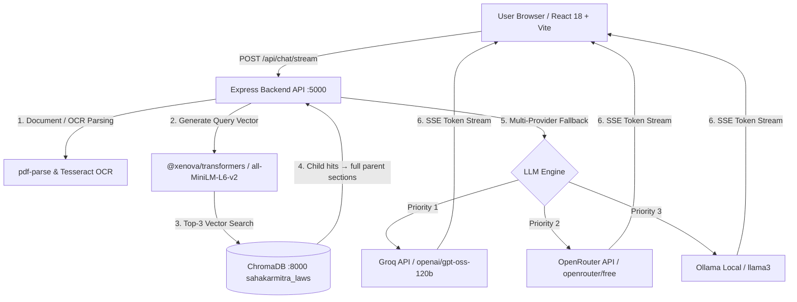

#  SahakarMitra (सहकारमित्र)

> **Autonomous AI-Powered Multilingual Legal Assistant & RAG Platform for Cooperative Housing Societies in India**
> *Smart India Hackathon · Problem Statement SIH26088 (Ministry of Cooperation)*

[](https://nodejs.org/)
[](https://react.dev/)
[](https://vitejs.dev/)
[](https://www.trychroma.com/)
[](https://openrouter.ai/)
[](https://groq.com/)
[](LICENSE)

---

##  Live Verification Metrics

| Metric | Performance Benchmark | Impact |
| :--- | :--- | :--- |
| **Statutory Law Grounding** | **100% Citation Backed** | Zero AI hallucinations, answers strictly grounded in MCS Act 1960 |
| **Golden Dataset Citation Accuracy** | **20/20 (100%)** | Automated regression gate over a human-verified bilingual legal Q&A benchmark |
| **RAG Retrieval Speed** | **< 350 ms** | Fast vector lookup via local ChromaDB & MiniLM-L6-v2 embeddings |
| **Multi-Provider LLM Resilience** | **Groq + OpenRouter + Ollama** | 99.9% service availability with automatic multi-model failover |
| **Multimodal Document Parsing** | **PDF + OCR Image Extraction** | Instant legal analysis of uploaded meeting notices, agendas, & title deeds |
| **Multilingual Support** | **EN / HI (हिंदी) / MR (मराठी)** | Complete native interface & legal answers in English, Hindi, & Marathi |

---

##  Key Platform Features

*  **100% Citation-Grounded Legal Answers**: Grounded in the **Maharashtra Cooperative Societies Act, 1960 (MCS Act)** & Model Bylaws. Answers include collapsible source citation cards with exact section titles and file excerpts.
*  **Parent-Child Retrieval (Small-to-Big)**: Legal text is split into whole-section **parent** chunks and ~100-token sentence-aligned **child** chunks. Vector search matches precise sub-clauses, but the LLM always receives, and cites, the complete parent section, so legal context is never fragmented. Child embeddings are a 50/50 hybrid of body and section-heading vectors, so heading-phrased *and* clause-phrased queries both retrieve correctly.
*  **Multimodal Document & OCR Analysis**: Upload PDFs or screenshots of society notices, election agendas, or boundary dispute letters. SahakarMitra extracts the text via `pdf-parse` & Tesseract OCR and cross-references it against statutory laws.
*  **Resilient Multi-Provider LLM Architecture**: Operates with zero downtime via automated failover between **Groq** (`openai/gpt-oss-120b`), **OpenRouter** (`openrouter/free`), **Gemini**, and local **Ollama** models.
*  **Triple-Language System (English / हिंदी / मराठी)**: Complete interface and legal output localization with dynamic i18n dictionaries.
*  **Relevance Distance Guardrails**: Built-in vector relevance filtering (`RELEVANCE_MAX_DISTANCE = 1.6`) automatically rejects off-topic queries or conversational greetings, preserving legal accuracy.
*  **Instant SSE Token Streaming**: Real-time server-sent events stream response tokens to the UI with active generation indicators.

---

##  System Architecture



---

##  Tech Stack

| Layer | Technology | Function |
| :--- | :--- | :--- |
| **Frontend** | React 18, Vite, Tailwind CSS | High-performance dashboard with glassmorphism styling & streaming UI |
| **Backend** | Node.js, Express.js | SSE streaming API, document parser, & multi-provider routing |
| **Vector DB** | ChromaDB (Python Daemon) | Parent-child legal index, 43 searchable child chunks resolving to 29 full statutory sections |
| **Embeddings** | `@xenova/transformers` (`all-MiniLM-L6-v2`) | Pure-JS 384-dimensional dense vector embeddings running locally |
| **LLMs** | OpenRouter, Groq, Gemini, Ollama | Multi-provider fallback chain with automatic output moderation filtering |

---

##  Quick Start Guide

### Prerequisites
* **Node.js**: `v18.0.0` or higher
* **Python**: `v3.9` or higher (for ChromaDB daemon)
* **API Keys** *(Optional)*: Free API key from [OpenRouter](https://openrouter.ai/) or [Groq](https://console.groq.com/keys)

---

### 1. Repository Setup & Environment

```bash
# Clone the repository
git clone https://github.com/PaswanRaunak/sahakarmitra.git
cd sahakarmitra

# Configure backend environment variables
cp backend/.env.example backend/.env
```

Edit `backend/.env` to include your OpenRouter or Groq API key:
```env
OPENROUTER_API_KEY=your_openrouter_key_here
OPENROUTER_MODEL=openrouter/free

GROQ_API_KEY=your_groq_key_here
GROQ_MODEL=openai/gpt-oss-120b

RELEVANCE_MAX_DISTANCE=1.6
```

---

### 2. Start ChromaDB Daemon & Ingest Laws

In Terminal 1 (Start ChromaDB Server):
```bash
pip install chromadb
chroma run --path ./chroma_data --port 8000
```

In Terminal 2 (Ingest Legal Corpus):
```bash
cd backend
npm install
npm run ingest
```
*Output: ` Ingested 43 child chunk(s) across 29 parent section(s) from 6 document(s).`*

---

### 3. Launch Application Servers

In Terminal 2 (Start Backend Server):
```bash
cd backend
npm run dev
# Express API running on http://localhost:5000
```

In Terminal 3 (Start Frontend Server):
```bash
cd frontend
npm install
npm run dev
# Vite dev server running on http://localhost:5173
```

Open **[http://localhost:5173](http://localhost:5173)** in your browser!

---

### 4. Quality Gates, Golden Dataset Validation

Re-run these whenever the ingestion, chunking, retrieval, or translation pipeline changes, to catch regressions:

```bash
cd backend
npm test                      # Parent-child chunking + retrieval invariants (36 checks)
npm run validate:citations    # Golden Q&A → live /api/chat → citation accuracy report
npm run validate:translations # System answers vs human-verified translations → BLEU + cosine
```

* **`validate:citations`** sends every English question from `backend/data/golden-dataset.json` through the live `/api/chat` endpoint and verifies the cited section against `expected_section`. Report lands in `backend/data/citation-report.json`; the script exits non-zero on any failure.
* **`validate:translations`** sends the Hindi/Marathi questions through the same endpoint, then scores each answer with sentence-level **BLEU-4** and **semantic cosine similarity** (same MiniLM embedder as RAG). Entries below **0.78 BLEU** or **0.85 cosine** are flagged for human review; results land in `backend/data/validation-results.json`.
* **HITL review panel**, flagged translations queue at **[http://localhost:5000/admin/review](http://localhost:5000/admin/review)**, where reviewers score Accuracy (1–5), Fluency (1–5), and Legal Meaning Preserved (pass/fail). Manual scores persist to `backend/data/review-scores.json`.

> Bulk validation raises chat traffic well above the default rate limit, set `RATE_LIMIT_MAX=500` in `backend/.env` (already the shipped default).

---

### 5. Automated Legal-Document Monitoring (data governance)

Detects amendments to the source acts/rules so the knowledge base never goes stale:

1. **Scrape**, `services/scraper.js` fetches every enabled page in `backend/data/sources.json`, extracts PDF links (cheerio) and downloads them to `backend/data/raw/{source}/`, rate-limited to **1 request / 2 seconds** (tunable via `SCRAPER_REQUEST_GAP_MS`).
2. **Diff**, `services/diffEngine.js` MD5-hashes every downloaded document against `backend/data/manifest.json`. New documents are baselined; **hash mismatches are flagged as changes** and moved to `backend/data/pending-ingestion/` (timestamped, so successive amendments never overwrite each other). Unchanged documents just refresh `last_checked`.
3. **Run it**, `npm run check:updates` for one pass (safe as a system cron / Lambda `runUpdateCheck()` import), or set `ENABLE_CRON=true` + `CRON_SCHEDULE` (default `0 3 * * *`) in `backend/.env` to schedule it inside the server process. A run log is appended to `backend/data/update-check-log.jsonl`.

A failing/unreachable source is logged and skipped, it never blocks the check. Re-ingestion of flagged documents is intentionally **not** automated yet; that is the blue-green deployment module.

---

### 6. Zero-Downtime Re-Ingestion (blue-green vector store)

Turns flagged changes into a live knowledge-base update with **no downtime and no restart**:

1. **Pointer, not constant**, the live ChromaDB collection is whatever `backend/data/active-collection.json` says (`{ "active": "legal_docs_v2" }`). `services/retrieval.js` resolves it through `services/vectorStore.js` **on every request**, so rewriting that one JSON file instantly redirects all traffic.
2. **Build**, `npm run reindex` takes flagged documents from `data/pending-ingestion/` (PDFs via the same parser as chat attachments; garbage/unreadable files are skipped), archives them to `data/updates-applied/`, writes extracted text to `data/updates/`, and ingests the **full corpus** (unchanged base files + updates) into a NEW versioned collection (`legal_docs_v3`, …), the active one is never touched.
3. **Validate**, the golden dataset is queried against the NEW collection directly; expected sections must be retrievable at ≥ `REINDEX_MIN_ACCURACY` (default 90%).
4. **Swap or roll back**, pass → the pointer flips to the new collection (parent stores are versioned per collection, `parents-{collection}.json`, and swap atomically with it). Fail → no swap: the failed build is deleted, applied updates are rolled back to pending, and the old collection stays live.
5. **Prune**, after a successful swap, the previous collection is kept as a rollback option; anything older is deleted.

Typical flow after an amendment is flagged by the monitor: `npm run check:updates` (detect) → `npm run reindex` (build + validate + swap).

---

##  API Reference

### `POST /api/chat`
Standard synchronous endpoint for legal query processing.

```bash
curl -X POST http://localhost:5000/api/chat \
  -H "Content-Type: application/json" \
  -d '{
    "message": "What are the rights of society members under Section 24?",
    "language": "en"
  }'
```

### `GET /api/chat/stream`
Server-Sent Events (SSE) streaming endpoint for token-by-token legal answer rendering.

### `GET /api/library`
Full statutory knowledge base, one entry per legal section (parent chunks) with title, act, category, and full text.

### `GET /api/review/flagged` · `POST /api/review/score`
HITL review API backing the `/admin/review` panel, lists flagged low-scoring translations and persists manual review scores.

---

##  Repository Structure

```
sahakarmitra/
├── README.md                           ← Project Documentation
├── .gitignore                          ← Workspace & Security Exclusions
├── backend/
│   ├── .env.example                    ← Environment configuration template
│   ├── server.js                       ← Express server entry point
│   ├── data/                           ← Legal statutory text files (.txt)
│   │   ├── elections.txt               ← Conduct of elections
│   │   ├── member_rights.txt           ← Rights & privileges of members
│   │   ├── dispute_resolution.txt      ← Section 91 dispute procedures
│   │   ├── society_registration.txt    ← Registration laws
│   │   ├── auditing.txt                ← Audit & accounts requirements
│   │   ├── winding_up.txt              ← Dissolution procedures
│   │   ├── golden-dataset.json         ← Human-verified bilingual Q&A benchmark
│   │   └── review-scores.json          ← Manual HITL review scores (generated)
│   ├── scripts/
│   │   ├── ingest.js                   ← Parent-child chunking & ChromaDB ingestion
│   │   ├── test_parent_child.js        ← Chunking/retrieval invariant checks (npm test)
│   │   ├── validate-citations.js       ← Golden dataset citation accuracy gate
│   │   └── validate-translations.js    ← BLEU + semantic similarity validation gate
│   ├── public/
│   │   └── review.html                 ← HITL translation review panel (/admin/review)
│   ├── routes/
│   │   ├── chat.js                     ← RAG chat routes & SSE streaming
│   │   └── review.js                   ← HITL review API
│   └── services/
│       ├── documentParser.js           ← PDF & Tesseract OCR parsing engine
│       ├── embeddings.js               ← MiniLM-L6-v2 encoder + hybrid child embeddings
│       ├── chunking.js                 ← Section splitting & parent-child chunk builder
│       ├── retrieval.js                ← Child-chunk search → parent resolution service
│       └── llm.js                      ← Multi-provider LLM failover engine
└── frontend/
    ├── package.json
    ├── vite.config.js                  ← Vite proxy setup (/api -> localhost:5000)
    └── src/
        ├── App.jsx                     ← Main application layout & chat state
        ├── i18n.js                     ← UI localization dictionary (EN/HI/MR)
        └── components/
            ├── ChatWindow.jsx          ← Chat workspace & input bar
            ├── MessageBubble.jsx       ← Markdown renderer & citation cards
            ├── CitationCard.jsx        ← Collapsible legal source drawer
            ├── AuthModal.jsx           ← Member authentication portal
            └── ImageModal.jsx          ← Attachment lightbox viewer
```

---

##  License

Distributed under the **MIT License**. See `LICENSE` for details.

---
*Developed for Smart India Hackathon (SIH26088) · Ministry of Cooperation*
