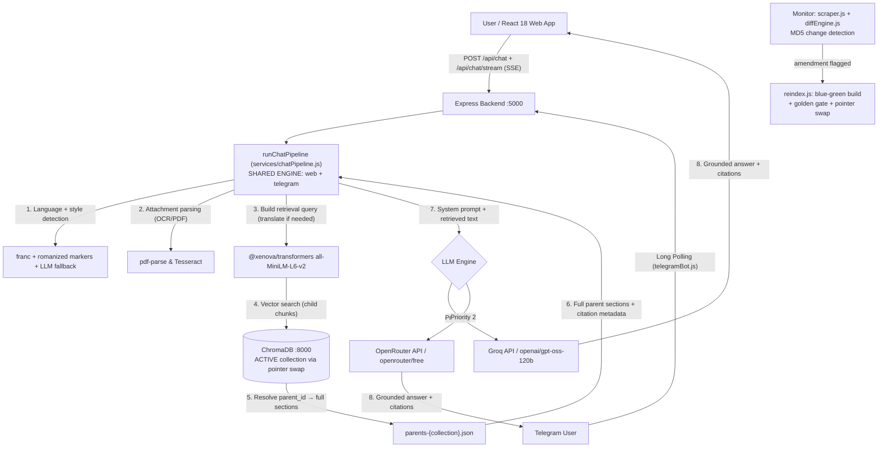

# SahakarMitra (सहकारमित्र)

> **Autonomous AI-Powered Multilingual Legal Assistant & RAG Platform for Cooperative Housing Societies in India**
> *Smart India Hackathon · Problem Statement SIH26088 (Ministry of Cooperation)*

[](https://nodejs.org/)
[](https://react.dev/)
[](https://vitejs.dev/)
[](https://www.trychroma.com/)
[](https://openrouter.ai/)
[](https://groq.com/)
[](https://telegram.org/)
[](LICENSE)

---

## Live Verification Metrics

| Metric | Performance Benchmark | Impact |
| :--- | :--- | :--- |
| **Statutory Law Grounding** | **100% Citation Backed** | Answers strictly grounded in the verified Acts, never invented |
| **Golden Dataset Citation Accuracy** | **20/20 (100%)** | Automated regression gate over a human-verified multilingual legal Q&A benchmark |
| **Jurisdictions Live** | **4 of 36 (validated rollout)** | Maharashtra, Gujarat, Karnataka + Multi-State Act 2002; each enabled only after passing the golden gate |
| **Languages Live** | **3 of 23 (validated rollout)** | English, Hindi, Marathi enabled; 20 more configured with honest "Coming soon" gating |
| **RAG Retrieval Speed** | **< 350 ms** | Vector lookup via local ChromaDB & MiniLM-L6-v2 embeddings |
| **Multi-Provider LLM Resilience** | **Groq + OpenRouter failover** | Automatic multi-model failover keeps the service available |
| **Multimodal Document Parsing** | **PDF + OCR Image Extraction** | Instant legal analysis of uploaded meeting notices, agendas & title deeds |
| **Channels** | **Web + Telegram + HITL admin** | One shared RAG engine (`chatPipeline.js`), three front ends |

---

## Key Platform Features

* **100% Citation-Grounded Legal Answers**: Every answer is grounded in the actual statutory text (state Cooperative Societies Acts + Multi-State Act 2002) and names its section. Collapsible citation cards show the exact source excerpt.
* **Parent-Child Retrieval (Small-to-Big)**: Legal text is split into whole-section **parent** chunks and ~100-token sentence-aligned **child** chunks. Vector search matches precise sub-clauses, but the LLM always receives and cites the complete parent section. Child embeddings are a 50/50 hybrid of body and section-heading vectors (L2-renormalized), so heading-phrased *and* clause-phrased queries both retrieve correctly.
* **State-Scoped Answers**: Pick your jurisdiction and retrieval filters to that state's Act, with an automatic cross-state notice when a provision comes from the Multi-State Act instead.
* **Language Style Mirroring**: The system detects the user's language AND form (native script vs romanized/mixed) with the franc library plus a marker-word table and LLM fallback, then mirrors it. Hinglish in, Hinglish out.
* **Zero-Downtime Knowledge Updates**: Amendments are detected by MD5 checksum monitoring and deployed through a validated blue-green swap of the vector store - no restart, no downtime, automatic rollback on a failed gate.
* **Honest Rollout Gating**: The state and language selectors only offer what has passed validation. Everything else is shown greyed out as "Coming soon" with a live "Coverage: 4/36 jurisdictions" indicator.
* **Multimodal Document & OCR Analysis**: Upload PDFs or screenshots of society notices; text is extracted via `pdf-parse` & Tesseract OCR and cross-referenced against statutory law.
* **Human-in-the-Loop Quality Panel**: Low-scoring translations are flagged automatically and reviewed by humans at `/admin/review` (Accuracy, Fluency, Legal Meaning Preserved).
* **Error Boundaries**: Section-level and app-level React error boundaries turn any component crash into a graceful recovery card instead of a blank page.
* **Per-Account Data Isolation**: Chat history and bookmarks are scoped per account email, so a new or different account never sees another account's data.

---

## System Architecture



---

## Tech Stack

| Layer | Technology | Function |
| :--- | :--- | :--- |
| **Frontend** | React 18, Vite, Tailwind CSS | Multi-view workspace with error boundaries, streaming UI, config-driven state/language selectors |
| **Backend** | Node.js, Express.js | Shared RAG pipeline (chatPipeline.js), SSE streaming, Telegram long-polling, document parser |
| **Vector DB** | ChromaDB (Python daemon) | Blue-green parent-child index: legal_docs_v5 (95 children / 64 sections), legal_docs_v4 rollback |
| **Embeddings** | `@xenova/transformers` (all-MiniLM-L6-v2) | Local 384-dim vectors; hybrid body+heading child embeddings, L2-renormalized |
| **LLMs** | Groq, OpenRouter | Multi-provider failover chain |
| **Bot** | `node-telegram-bot-api` | Telegram channel over the same shared pipeline |

---

## Quick Start Guide

### Prerequisites
* **Node.js**: `v18.0.0` or higher
* **Python**: `v3.9` or higher (for the ChromaDB daemon)
* **API Keys** *(Optional)*: Free key from [Groq](https://console.groq.com/keys) or [OpenRouter](https://openrouter.ai/)

---

### 1. Repository Setup & Environment

```bash
git clone https://github.com/PaswanRaunak/sahakarmitra.git
cd sahakarmitra
cp backend/.env.example backend/.env
```

Edit `backend/.env` with your keys:
```env
OPENROUTER_API_KEY=your_openrouter_key_here
GROQ_API_KEY=your_groq_key_here
GROQ_MODEL=openai/gpt-oss-120b
RATE_LIMIT_MAX=500
```

---

### 2. Start ChromaDB & Ingest the Laws

Terminal 1:
```bash
pip install chromadb
chroma run --path ./chroma_data --port 8000
```

Terminal 2:
```bash
cd backend
npm install
npm run ingest
```
*Output: `Ingested 95 child chunk(s) across 64 parent section(s) from 8+ file(s) into "<active collection>"`*

---

### 3. Launch the App

Terminal 2:
```bash
cd backend
npm start          # Express API on http://localhost:5000
```

Terminal 3:
```bash
cd frontend
npm install
npm run dev        # Vite dev server on http://localhost:5173
```

Open **[http://localhost:5173](http://localhost:5173)**. Click *Launch Legal Assistant* → *Continue as Guest*.

---

### 4. Quality Gates (golden dataset)

Run after any ingestion, chunking, retrieval, or translation change:

```bash
cd backend
npm test                      # 36 parent-child chunking/retrieval invariants
npm run validate:citations    # Golden Q&A -> live API -> citation accuracy (currently 100%)
npm run validate:translations # Style-matched BLEU + cosine scoring (100 tests)
npm run test:style            # Language-style detection: 10 cases + 4 live mirror checks
```

* **validate:citations** verifies the cited section against `expected_section` for every English golden question; exits non-zero on failure. Report: `backend/data/citation-report.json`.
* **validate:translations** scores every style variant (en, hi, hi_romanized, mr, mr_english) with BLEU-4 and semantic cosine similarity. Entries below **0.78 BLEU** or **0.85 cosine** are flagged for human review. Results: `backend/data/validation-results.json`.
* **HITL review panel**: flagged translations queue at **[http://localhost:5000/admin/review](http://localhost:5000/admin/review)** for human scoring (Accuracy 1-5, Fluency 1-5, Legal Meaning pass/fail); scores persist to `backend/data/review-scores.json`.

> Set `RATE_LIMIT_MAX=500` in `backend/.env` (shipped default) so bulk validation passes the rate limiter.

---

### 5. Automated Legal-Document Monitoring

Detects amendments so the knowledge base never goes stale:

1. **Scrape**: `services/scraper.js` fetches every enabled page in `backend/data/sources.json`, extracts PDF links (cheerio), and downloads them to `backend/data/raw/{source}/`, rate-limited to 1 request / 2 seconds (`SCRAPER_REQUEST_GAP_MS`).
2. **Diff**: `services/diffEngine.js` MD5-hashes every download against `backend/data/manifest.json`. New files are baselined; hash mismatches are flagged and moved to `backend/data/pending-ingestion/` (timestamped). Unchanged files just refresh `last_checked`.
3. **Run**: `npm run check:updates` for one pass (also importable as `runUpdateCheck()` for cron/Lambda), or set `ENABLE_CRON=true` + `CRON_SCHEDULE` in `backend/.env` to schedule it inside the server process. Runs append to `backend/data/update-check-log.jsonl`.

Unreachable sources are logged and skipped, never fatal. Flagged documents feed the blue-green reindex below.

---

### 6. Zero-Downtime Re-Ingestion (blue-green vector store)

1. **Pointer, not constant**: the live ChromaDB collection is whatever `backend/data/active-collection.json` says. `services/retrieval.js` resolves it per request via `services/vectorStore.js`, so rewriting that one file redirects all traffic instantly.
2. **Build**: `npm run reindex` takes flagged documents from `data/pending-ingestion/` (PDFs via the same parser as chat attachments), writes clean text to `data/updates/`, and ingests the FULL corpus into a NEW versioned collection (`legal_docs_v6`, ...). The active collection is never touched.
3. **Validate**: the golden dataset is tested against the NEW collection; expected sections must be retrievable at >= `REINDEX_MIN_ACCURACY` (default 90%).
4. **Swap or roll back**: pass -> the pointer flips (parent stores swap atomically with it). Fail -> the build is deleted, updates roll back, the old collection stays live.
5. **Prune**: after a swap the previous collection is kept as rollback; anything older is deleted.

Flow: `npm run check:updates` (detect) -> `npm run reindex` (build + validate + swap).

---

### 7. Telegram Bot Channel

The same shared pipeline, available inside Telegram:

1. Message **@BotFather** on Telegram, send `/newbot`, and copy the token.
2. Add to `backend/.env`: `TELEGRAM_BOT_TOKEN=123456:ABC-DEF...`
3. Run:
```bash
cd backend
npm run telegram-bot
```

* Long polling (no webhook or public URL needed), runs alongside the web server.
* `/start` and `/help` show a welcome with example questions; `/state` and `/language` switch jurisdiction and language per user (remembered in a session map).
* Every free-text message runs the same style-detection + RAG pipeline and replies with HTML-formatted answers plus "Verified sources" citation blocks.
* It is a separate process (`scripts/start-telegram-bot.js`) and never interferes with the web server.

---

### 8. State Onboarding (add a jurisdiction)

Cooperative law is a state subject, so each state's REAL Act text must be sourced and verified before its content can be used. Placeholder legal text is never generated.

```bash
cd backend
npm run onboard-state -- "Tamil Nadu" "C:/legal/tamil-nadu-act-1983.pdf"
```

The pipeline: integrity check (the document header must actually match the state/Act - wrong-state documents are refused) -> text extraction and archive -> blue-green reindex into a new collection -> golden gate -> 3-5 seed questions derived from the state's own ingested sections validated through the live API (>= 90% required) -> `state-config.json` flips the state to enabled. On any failure everything rolls back and the old collection stays live.

Check progress any time: `curl http://localhost:5000/api/states` reports every jurisdiction with enabled/validated flags and the live coverage count.

---

## API Reference

### `POST /api/chat`
Blocking legal Q&A. Accepts `{ message, language, state, history, attachments }` and returns `{ answer, sources: [{section, act_name, state, excerpt}], parsedFiles }`.

### `POST /api/chat/stream`
Server-Sent Events token streaming (used by the web chat UI).

### `GET /api/library`
The full knowledge base: one entry per legal parent section with title, act, category, state, and full text.

### `GET /api/states` · `GET /api/languages`
Rollout configs driving the UI selectors: every jurisdiction/language with `{enabled, validated}` flags plus live coverage counts.

### `GET /api/review/flagged` · `POST /api/review/score`
HITL review API backing the `/admin/review` panel.

### `GET /api/health`
Liveness + readiness: LLM key configured, knowledge-base file count.

---

## Repository Structure

```
sahakarmitra/
├── README.md                           <- Project Documentation
├── .gitignore                          <- Workspace & Security Exclusions
├── backend/
│   ├── .env.example                    <- Environment configuration template
│   ├── server.js                       <- Express entry: chat, library, states, languages, review, geo, health
│   ├── data/
│   │   ├── *.txt                       <- Legal statutory corpus (per chapter + per state)
│   │   ├── golden-dataset.json         <- Human-verified multilingual Q&A benchmark (variants structure)
│   │   ├── state-config.json           <- Jurisdiction rollout registry (36 entries, enabled flags)
│   │   ├── language-config.json        <- Language rollout registry (23 entries, enabled flags)
│   │   ├── romanized-markers.json      <- Romanized-script marker words (Hinglish detection data)
│   │   ├── sources.json                <- Government monitoring sources (scraper config)
│   │   └── review-scores.json          <- Manual HITL review scores (generated)
│   ├── scripts/
│   │   ├── ingest.js                   <- Parent-child ingestion into the active collection
│   │   ├── reindex.js                  <- Blue-green rebuild: validate -> swap -> prune
│   │   ├── onboard-state.js            <- State onboarding: integrity -> reindex -> seed gate -> flip
│   │   ├── scheduled-check.js          <- Scraper + diff orchestrator (cron / serverless ready)
│   │   ├── validate-citations.js       <- Golden dataset citation accuracy gate
│   │   ├── validate-translations.js    <- Style-matched BLEU + cosine validation gate
│   │   ├── validate-language.js        <- Per-language rollout gate (flips config on pass)
│   │   ├── test_parent_child.js        <- Chunking/retrieval invariants (npm test)
│   │   ├── test_language_style.js      <- Language detection + mirror checks (npm run test:style)
│   │   ├── test_telegram_smoke.js      <- Formatter + pipeline smoke test
│   │   └── start-telegram-bot.js       <- Telegram bot entry point (long polling)
│   ├── public/
│   │   └── review.html                 <- HITL translation review panel (/admin/review)
│   ├── routes/
│   │   ├── chat.js                     <- /api/chat + /api/chat/stream (uses chatPipeline)
│   │   ├── review.js                   <- HITL review API
│   │   └── geo.js                      <- IP-based state detection
│   └── services/
│       ├── chatPipeline.js             <- SHARED RAG engine (web + Telegram converge here)
│       ├── llm.js                      <- LLM failover + language detection + style mirroring prompt
│       ├── retrieval.js                <- Child search -> parent resolution (metric-aware cutoffs)
│       ├── chunking.js                 <- Section splitting + parent-child builder (config-driven)
│       ├── embeddings.js               <- MiniLM encoder + hybrid child embeddings
│       ├── vectorStore.js              <- Active-collection pointer + atomic swap primitives
│       ├── telegramBot.js              <- Telegram channel (sessions, commands, HTML formatting)
│       ├── scraper.js                  <- Government source scraper (rate-limited)
│       ├── diffEngine.js               <- MD5 change detection + pending flagging
│       └── documentParser.js           <- PDF & Tesseract OCR parsing engine
└── frontend/
    ├── package.json
    ├── vite.config.js                  <- Vite proxy (/api -> localhost:5000)
    └── src/
        ├── App.jsx                     <- View routing, per-account storage, error boundary tree
        ├── i18n.js                     <- UI localization dictionary (EN/HI/MR, English fallback)
        └── components/
            ├── ChatWindow.jsx          <- Chat workspace & input bar
            ├── MessageBubble.jsx       <- Markdown renderer & citation cards
            ├── CitationCard.jsx        <- Collapsible legal source drawer
            ├── Sidebar.jsx             <- Sessions, navigation, profile
            ├── DashboardView.jsx       <- Live stats strip, inquiries, guides
            ├── LibraryView.jsx         <- Knowledge repository (grouped, searchable)
            ├── ExpertsView.jsx         <- Consultant directory + booking modals
            ├── SettingsView.jsx        <- Profile / language / security / API keys
            ├── StateModal.jsx          <- Config-driven state selector + coverage badge
            ├── LanguageMenu.jsx        <- Config-driven language dropdown + "Coming soon"
            ├── ErrorBoundary.jsx       <- Section/app crash recovery (no blank pages)
            ├── LandingPage.jsx         <- Public page with live coverage stats
            ├── AuthModal.jsx           <- Demo authentication portal
            └── ImageModal.jsx          <- Attachment lightbox viewer
```

---

## License

Distributed under the **MIT License**. See `LICENSE` for details.

---
*Developed for Smart India Hackathon (SIH26088) · Ministry of Cooperation*
